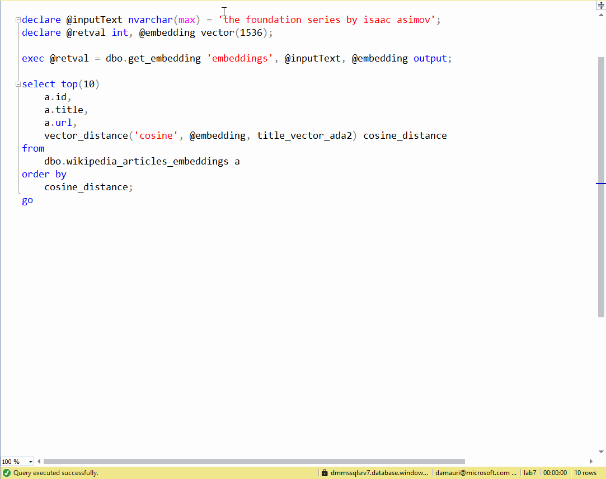

# Vector similarity search with Azure SQL & Azure OpenAI

This example shows how to use Azure OpenAI from Azure SQL database to get the vector embeddings of any chosen text, and then calculate the [cosine similarity](https://learn.microsoft.com/en-us/azure/storage/common/storage-sas-overview) against the Wikipedia articles (for which vector embeddings have been already calculated,) to find the articles that covers topics that are close - or similar - to the provided text.

For an introduction on text and code embeddings, check out this OpenAI article: [Introducing text and code embeddings](https://openai.com/blog/introducing-text-and-code-embeddings).

## Native or Classic?

Azure SQL database can be used to easily and quickly perform vector similarity search. There are two options for this: a native option and a classic option.

The **native option** is to use the new Vector Functions, recently introduced in Azure SQL database. Vector Functions are a set of functions that can be used to perform vector operations directly in the database. 

> [!NOTE]  
> Vector Functions are in Public Preview. Learn the details about vectors in Azure SQL here: https://aka.ms/azure-sql-vector-public-preview



The **classic option** is to use the classic T-SQL to perform vector operations, with the support of columnstore indexes for getting good performance.

> [!IMPORTANT]  
> This branch (the `main` branch) uses the native vector support in Azure SQL. If you want to use the classic T-SQL, switch to the `classic` branch.

## Download and import the Wikipedia Article with Vector Embeddings

Download the [wikipedia embeddings from here](https://cdn.openai.com/API/examples/data/vector_database_wikipedia_articles_embedded.zip), unzip it and upload it (using [Azure Storage Explorer](https://learn.microsoft.com/azure/vs-azure-tools-storage-manage-with-storage-explorer?tabs=windows) for example) to an Azure Blob Storage container.

In the example the unzipped CSV file `vector_database_wikipedia_articles_embedded.csv` is assumed to be uploaded to a blob container named `playground` and in a folder named `wikipedia`.

Once the file is uploaded, get the [SAS token](https://learn.microsoft.com/azure/storage/common/storage-sas-overview) to allow Azure SQL database to access it. (From Azure storage Explorer, right click on the `playground` container and then select `Get Shared Access Signature`. Set the expiration date to some time in future and then click on "Create". Copy the generated query string somewhere, for example into Notepad, as it will be needed later)

Use a client tool like [Azure Data Studio](https://azure.microsoft.com/products/data-studio/) to connect to an Azure SQL database and then use the `./vector-embeddings/01-import-wikipedia.sql` to create the `wikipedia_articles_embeddings` table where the uploaded CSV file will be imported.

Make sure to replace the `<account>` and `<sas-token>` placeholders with the value correct for your environment:

- `<account>` is the name of the storage account where the CSV file has been uploaded
- `<sas-token>` is the Share Access Signature obtained before

Run each section (each section starts with a comment) separately. At the end of the process (will take up to a couple of minutes) you will have all the CSV data imported in the `wikipedia_articles_embeddings` table.

## Add embeddings columns to table

In the imported data, vectors are stored as JSON arrays. To take advtange of vector processing, the arrays must be saved into a more compact and optimized binary format index. Thanks to the new `VECTOR` type, turning a vector into a set of values that can be saved into a column is very easy:

```sql
alter table wikipedia_articles_embeddings
add title_vector_ada2 vector(1536);

update 
    wikipedia_articles_embeddings
set 
    title_vector_ada2 = cast(title_vector as vector(1536)),
```

The script `./vector-embeddings/02-use-native-vectors.sql` does exactly that. It takes the existing columns with vectors stored in JSON arrays and turns them into vectors saved in binary format.

## Find similar articles by calculating cosine distance

Make sure to have an Azure OpenAI [embeddings model](https://learn.microsoft.com/azure/cognitive-services/openai/concepts/models#embeddings-models) deployed and make sure it is using the `text-embedding-ada-002` model.

Once the Azure OpenAI model is deployed, it can be called from Azure SQL database using [sp_invoke_external_rest_endpoint](https://learn.microsoft.com/sql/relational-databases/system-stored-procedures/sp-invoke-external-rest-endpoint-transact-sql), to get the embedding vector for the "the foundation series by isaac asimov", text, for example, using the following code (make sure to replace the `<your-api-name>` and `<api-key>` with yout Azure OpenAI deployment):

```sql
declare @inputText nvarchar(max) = 'the foundation series by isaac asimov';
declare @retval int, @response nvarchar(max);
declare @payload nvarchar(max) = json_object('input': @inputText);
exec @retval = sp_invoke_external_rest_endpoint
    @url = 'https://<your-api-name>.openai.azure.com/openai/deployments/<deployment-id>/embeddings?api-version=2023-03-15-preview',
    @method = 'POST',
    @headers = '{"api-key":"<api-key>"}',
    @payload = @payload,
    @response = @response output;
select @response;
```

The vector returned in the response can extracted using `json_query`:

```sql
set @re = json_query(@response, '$.result.data[0].embedding')
```

Now it is just a matter of taking the vector of the sample text and the vectors of all wikipedia articles and calculating the cosine similarity. The math can be easily expressed in T-SQL:

```sql
vector_distance('cosine', @embedding, title_vector) 
```

## Encapsulating logic to retrieve embeddings

The described process can be wrapped into stored procedures to make it easy to re-use. The scripts in the `./vector-embeddings/` directory show how to create a stored procedure to retrieve the embeddings from OpenAI:

- `03-store-openai-credentials.sql`: stores the Azure OpenAI credentials in the Azure SQL database
- `04-create-get-embeddings-procedure.sql`: creates a stored procedure to encapsulate the call to OpenAI using the script. 

## Finding similar articles

The script `05-find-similar-articles.sql` uses the created stored procedure and the process explained above to find similar articles to the provided text. 

## Alternative sample with Python and a local embedding model

If you don't want to, or can't use OpenAI to generate embeddings, you can use a local model like `https://huggingface.co/sentence-transformers/multi-qa-MiniLM-L6-cos-v1` to generate embeddings. The Python script `./python/hybrid_search.py` shows how to 

- use Python to generate the embeddings 
- do similarity search in Azure SQL database
- use [Fulltext search in Azure SQL database with BM25 ranking](https://learn.microsoft.com/en-us/sql/relational-databases/search/limit-search-results-with-rank?view=sql-server-ver16#ranking-of-freetexttable)
- do re-ranking applying Reciprocal Rank Fusion (RRF) to combine the BM25 ranking with the cosine similarity ranking

Make sure to setup the database for this sample using the `./python/00-setup-database.sql` script. The database can be either an Azure SQL DB or a SQL Server database.

## Conclusions

Azure SQL database, now has support to perform vector operations directly in the database, making it easy to perform vector similarity search. Using vector search along with fulltext search and BM25 ranking, it is possible to build powerful search engines that can be used in a variety of scenarios. 

> [!NOTE]  
> Vector Functions are in Early Adopter Preview. Get access to the preview via https://aka.ms/azuresql-vector-eap-announcement

## More resources

- [Azure SQL & AI](https://aka.ms/sql-ai)
- [Azure SQL Vector Samples](https://github.com/Azure-Samples/azure-sql-db-vector-search)
